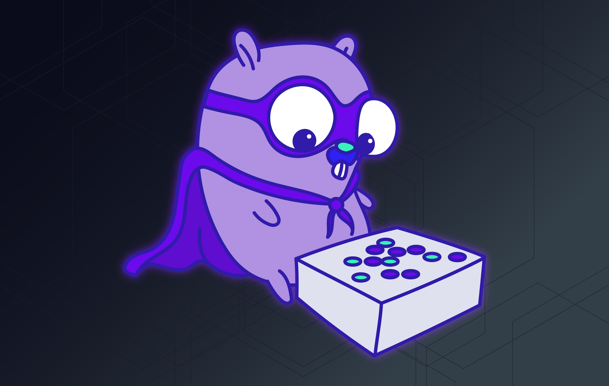
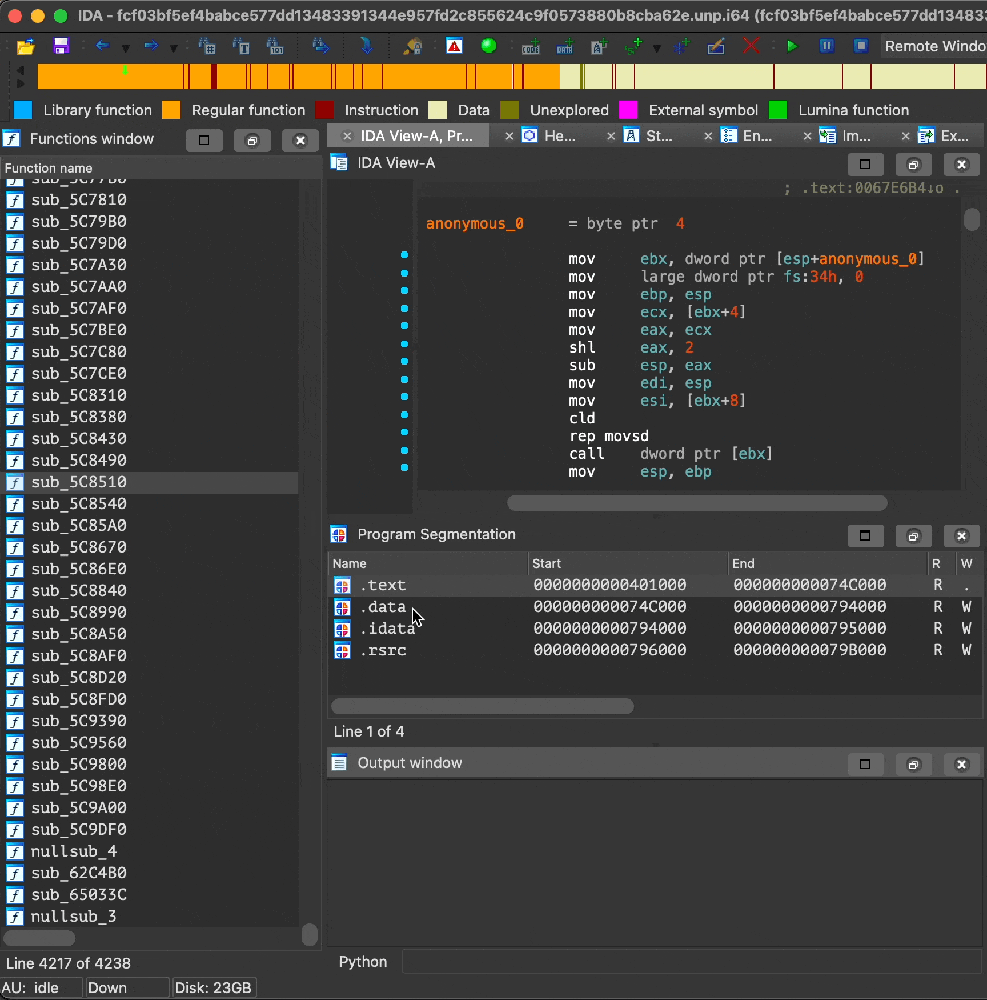
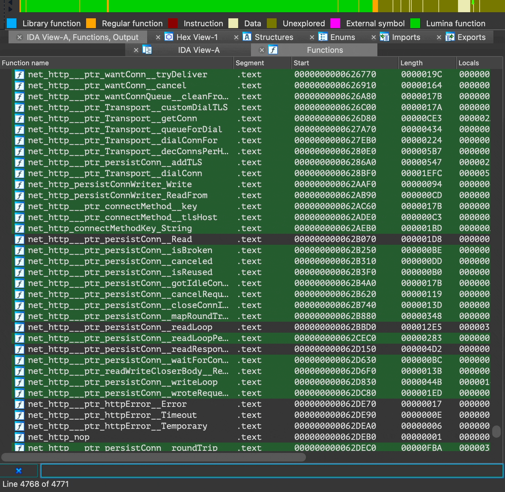

# AlphaGolang 
*by Juan Andres Guerrero-Saade (JAG-S @ SentinelLabs)*

### Description: 
AlphaGolang is a collection of IDAPython scripts to help malware reverse engineers master Go binaries. The idea is to break the scripts into concrete steps, thus avoiding brittle monolithic scripts, and mimicking the methodology an analyst might follow when tackling a Go binary.

Scripts are released under GPL license (honoring Tim Strazzere's original GolangLoaderAssist which we refactored and updated for python3, props to Tim :) ). Contributions are welcome and encouraged!

**Requirements: IDA Pro (ideally v7.6+) and Python3 (ew)**
The first two steps (recreate_pclntab and function_discovery_and_renaming) will work on IDA v7.5- but scripts beyond that require IDAv7.6+. Newer versions are the ideal target for newer scripts going forward.

**Original Reference:** Mandiant Cyber Defense Summit 2021 talk (Video Pending)

# AlphaGolang Analysis Methodology

 - ## Step 0: YARA rule to identify Go binaries (PE/ELF/MachO)
    - identify_go_binaries.yara
        - Simple header check + regex for Go build ID string.
        - Could probably improve the build ID length range.

 - ## Step 1: Recreate pcln table
   

    - recreate_pclntab.py (IDA v7.5- compatible)
        - Recreates the gopclntab section from heuristics
        - Mostly useful for IDA v7.5-

 - ## Step 2: Discover functions by walking pcln table and add names to all
   

    - function_renaming.py (IDA v7.5- compatible)
        - Split from golang loader assist
        - Bruteforces discovery of missing functions based on the pcln table
        - Fixed some function name cleaning issues from the py3 transition

 - ## Step 3: Surface user-generated functions
   
   
   - categorize_go_folders.py (Requires IDA v7.6+)
        - Automagically categorizes functions into folders
        - Requires IDAv7.6 + 'show folders' to be enabled in functions view

 - ### Step 4: Fix string references
   

    - fix_string_cast.py
        - Split from golang loader assist
        - Added logic to undefine previously existing string blobs before defining new string
        - New sanity checks make it far more effective

 - ### Step 5: Extract type information
	- extract_types.py
		- Comments the arguments of all calls to `newobject`, `makechan`, etc.
		- Applies the correct C type to these objects and renames them
		- Obtains the human-readable name and adds it as a comment

### Pending fixes and room for contributions:
 - fix_string_cast.py 
        - Still needs refactoring + better string load heuristics
 - extract_types.py
		- Only works on PE files currently and looks for the hardcoded `.rdata` section
		- A proper check / implementation for varint-encoded sizes is needed

### Next steps:
 - Track strings references by user-generated functions
 - Auto generate YARA signatures based on user-generated functions 
 - Generate hex-rays pseudocode output for user-generated functions 
 - Automatically set breakpoints for dynamic analysis of arguments
 - ???

### Credit to:
 - Tim Strazzere for releasing the original [golang_loader_assist](https://github.com/strazzere/golang_loader_assist)
 - Milan Bohacek (Avast Software s.r.o.) for his invaluable help figuring out the idatree API.
 - Joakim Kennedy (Intezer) 
 - Ivan Kwiatkowski (Kaspersky GReAT) for step 5.
 - Igor Kuznetsov (Kaspersky GReAT)
